class: center, middle

# Ben Moss
### Bitfield Consulting

[ben@bitfield.co](mailto:ben@bitfield.co)

[github.com/drteeth](https://github.com/drteeth)

[@benjamintmoss](https://twitter.com/benjamintmoss)

???

Hi I’m Ben Moss,
* I consultant doing Ruby, Elixir and Android work through my shop Bitfield

---
class: center, middle

# Event sourcing/CQRS in Elixir with Commanded:
## Where the rubber hits the road.

???

This is my 2nd talk on ES/CQRS, the last one was theoretical and this will be about how to apply the patterns in Elixir.

---
class: center, middle, inverse

# Recap
Last talk:
https://drteeth.github.io/elixir-es-cqrs

???

There are a number of talks out there describing both ES and CQRS, including one of my own so I will try to recap the patterns very quick and move on to the implementation details.

---
class: center, middle

# Event Sourcing
Building up state from a series of events that describe facts and mutations.

???

This is the idea that instead of recording the current state of a model, we instead record the history of mutations against it and build up the state of the model from there. We'll go into more detail soon.

---
class: center, middle

# CQRS
### Command Query Responsibility Segregation
Separate the read and write models.

???

The main idea here is that there is code that models writing new data and then there is code that handles reads and that they can evolve separately.

We'll see more on that shortly.

---
class:

# The pieces:
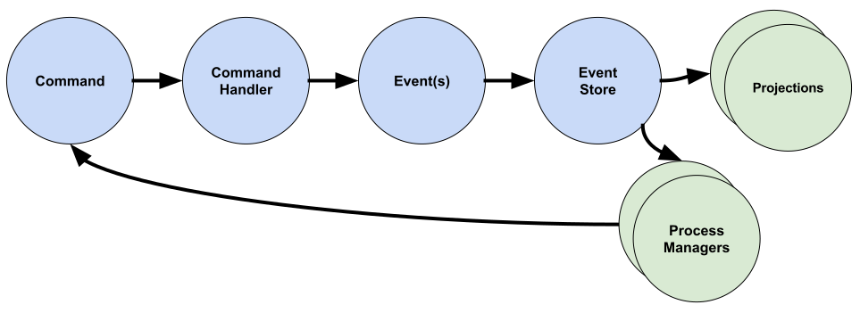

???

These are the main components in our system. We'll cover each in detail as we go through the code.

---
class:

# The Project: Attend
* Attendance tracker for my pickup soccer league.
* Schedules games for teams
* Allow teams to ask their members for attendance to a game.
* Members can reply by clicking a link in their email.

???

To go through the example, I'll go over an attendance tracker that I wrote for a soccer leage I play with. The idea is that for each game, the app will send out an email to each player asking if they will attend, and they can respond yes/no/maybe with a click.

It's quite simple, but it will take us through some interesting aspects of the patterns.

---
class: middle, center

Demo time

???

Register a team
Add a player
Schedule a game
Start a Check
Answer a Check

---
class: middle, center, inverse

# The Write Side

???

First I'll cover the write side.

---
class:

# An acceptance test to work from

```elixir
# Register a new team
team_id = Attend.register_team("The Alchemists")

# Add a player
Attend.add_player_to_team(team_id, "Mattia", "mattia@example.com")

# Schedule a game for that team
game_id = Attend.schedule_game(team_id, "Blah Park", @game_time)

# Check the attendance for the game and that team
Attend.check_attendance(game_id, team_id)

# Simulate clicking "Yes" in the email sent to Mattia
{player_check_id, yes_token} = parse_token(last_email(), "Yes")
Attend.confirm_attendance(player_check_id, yes_token)
```

???

You can imagine working from an acceptance test something like this.
* Register a team
* Add a player
* Schedule a game
* Check attendance
* Confirm attendance

---
class:
# The API, Command and Router

* Commands are structs
* The router dispatches commands for us.
* IDs can be generated or passed in
* Nothing else is returned. We don't read here, this is the write side.

```elixir
defmodule Attend
  def schedule_game(team_id, location, start_time) do
  game_id = UUID.generate()

  command = %ScheduleGame{
    game_id: game_id,
    team_id: team_id,
    location: location,
    start_time: start_time
  }

  case Router.dispatch(command) do
    :ok ->
      {:ok, game_id}

    error ->
      error
  end
end
```

???

We'll pickup in the middle where we're scheduling a game for a team.
We create a new instance of a command, which are structs, and dispatch it with the Router which we'll see next.

We generate and return the ID here but often people will generate the ID on the client side and just return "OK".

---
class:

# The Command

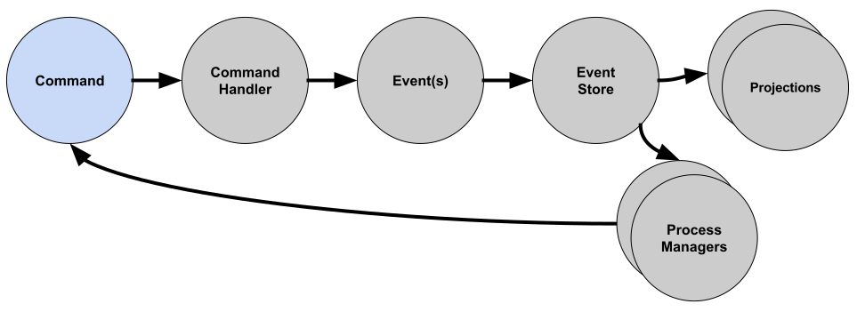

---
class:

# The Command

* It’s a serializable struct.
* Named in the imperative

```elixir
defmodule Attend.Commands.ScheduleGame do
  @derive Jason.Encoder
  defstruct [:game_id, :team_id, :location, :start_time]
end
```

???

It's a struct that represents the command. Here we're want to schedule a game.

---
class:
# The Router

* Maps commands to aggregates
* Specifies an indentity
* Will find or create the GenServer for aggregate + identity

```elixir
defmodule Attend.CommandRouter do
  dispatch(
    [
      ScheduleGame,
      CheckAttendance,
      StartGame,
      CancelGame,
      EndGame
    ],
    to: Game,
    identity: :game_id
  )
end
```

???

Here we map the ScheduleGame command to the Game. Commanded will spawn a GenServer based on the identity and module type given.

---
class:

# The Aggregate

* Is a module with a struct
* Is backed by a GenServer and spawned lazily
* Can be spun down after a period of inactivity
* Allows serial access to an instance of an aggregate

```elixir
defmodule Attend.Aggregates.Game do
  defstruct [
    :game_id,
    :location,
    :team_id,
    :start_time,
    :status
  ]
```
???

The aggregate is a struct representing the current state for the purposes of validating commands against. This is the model of our game on the write side.

---
class:

# The Aggregate
### (as Command Handler)


---
class:

# The Aggregate
### (as Command Handler)

* Returns an error tuple or 0 or more events

```elixir
  def execute(%Game{} = game, %ScheduleGame{} = command) do
    %GameScheduled{
      game_id: command.game_id,
      team_id: command.team_id,
      location: command.location,
      start_time: command.start_time
    }
  end
```

???

This is the spot where we decide if we're going to accept or reject a command. If we accept it, we'll emit 1 or more events which describe the change in the system.

If we reject it, we'll return an error we can show to the user.

This is the first Command in the Game's lifecycle and we're returning a GameScheduled event.

---
class:

# The Event

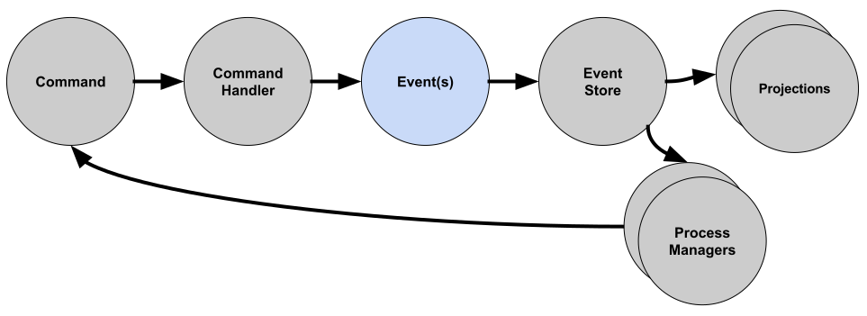

---
class:
# Event

* It’s a serializable struct
* Named in past tense
* Represents a fact about our system
* Often the paired with a Command (ScheduleGame => GameScheduled)

```elixir
defmodule Attend.Events.GameScheduled do
  @derive Jason.Encoder
  defstruct [:game_id, :team_id, :location, :start_time]
end
```

???

Not much to say here yet other than these are the gold in your system. They enable everything else.

---
class:

# The Aggregate
### (applying events for new state)

* Apply clause for each event on an aggregate
* Take the old state and event as input
* Returns the new state
* Applied after the events have been persisted
* Also applied when re-hydrating the aggregate


```elixir
  def apply(%Game{} = game, %GameScheduled{} = event) do
    %{ game |
        game_id: event.game_id,
        team_id: event.team_id,
        location: event.location,
        start_time: event.start_time,
        status: :scheduled
    }
  end
```

???

Here we're setting up the initial state of our Game so we can validate further commands against it later.

---
# The Aggregate
### (a 2nd command)

* Validate input based on state
* Protect invariants
* Our oportunity to give feedback to the user

```elixir
  def execute(%Game{} = game, %CheckAttendance{} = command) do
    cond do
      game.status == :cancelled ->
        {:error, :game_cancelled}

      game.status == :ended ->
        {:error, :game_already_ended}

      game.team_id != command.team_id ->
        {:error, :team_not_scheduled_for_game}

      true ->
        %AttendanceCheckStarted{
          check_id: command.check_id,
          game_id: command.game_id,
          team_id: command.team_id
        }
    end
  end
```

???

Here we're handling another command against our aggregate. We only want to allow an attendance check if the game scheduled. We also want to provide meaningful feedback to the user if we reject the command.

---
class:

# The story so far:

* Maintain invariants with aggregate
* There's 1 per ID/Type: Game(123), Game(234), Team(345)
* Aggregates are running concurently with each other
* Aggregates run serially internally
* Express and capture a series of intents
* Transform those into immutable facts

???

---
class: middle, center, inverse

# The Read Side

???

We can leave the write side for now and see how we get data out of the system. Queries are handled by the read side.

---
class:

# Projections / Event Handlers

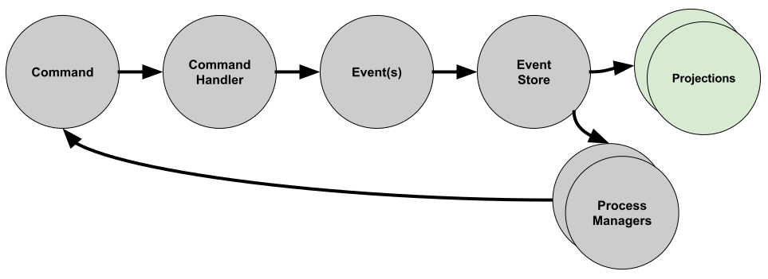

???

The read side is a series of what is called projections of the events into an cohesive whole that we can query on.

---
class:

# Projections / Event Handlers

* Populate caches/tables to handle queries from the UI
* Built on the events from the Write side
* 1 GenServer per Projection
* Listens for Events and performs effects
* Writing to a cache, sending an email, etc

???

---

# TeamDetail projection

```elixir
defmodule Attend.EventHandlers.TeamProjector do
  use Commanded.Event.Handler, name: __MODULE__

  def handle(%Events.TeamRegistered{} = event, _metadata) do
    TeamDetail.insert(%Team{
      id: event.team_id,
      name: event.name,
      players: []
    })
    :ok
  end
```

???

Here we have the Team detail projection. It's job is to listen for all of the events that it need to produce a blob of detail that the UI can use to fill out the detail view of the team. That means: Upcoming games, team members, name etc.

We start off by listening for the Team Register even and persist that to disk. Storage is not prescribed, I'm using redis here but I've hidden the details away behind a module.

---


# Team projection

```elixir
  def handle(%Events.JoinedTeam{} = event, _metadata) do
    TeamDetail.get(event.team_id)
    |> TeamDetail.add_player(event.player)
    :ok
  end

  def handle(%Events.LeftTeam{} = event, _metadata) do
    TeamDetail.get(event.team_id)
    |> TeamDetail.remove_player(event.player)
    :ok
  end
```

???

For subsequent team events, we can update the state

---

# Team projection

```elixir
  def handle(%Events.GameScheduled{} = event, _metadata) do
    Team.add_game(%Game{
      game_id: event.game_id,
      location: event.location,
      start_time: event.start_time,
      team_id: event.team_id
    })
    :ok
  end

  def handle(%Events.GameCancelled{} = _event, _metadata) do
     # Mark the game cancelled
    :ok
  end

  def handle(%Events.GameEnded{} = _event, _metadata) do
     # Mark the game ended
    :ok
  end
```

???

Event handlers can use events from across aggregates to build up their state

---

We've seen enough of the basic now that we can continue this way for a long while:
* Register team
* Add player
* Remove player
* Cancel game
* Start game
* End game

Will all follow this basic pattern more or less. We can continue to add projections and handlers as we've seen. There's one problem though.

We can see it when we go to request attendance for a team's players to a game.

---

# Attendance Check

### Requirements
* Don't allow a *Check* to be requested for a *Game* that has ended or been cancelled.
* Ask each player from a given *Team* if they will be attending a given Game.
* Wait to hear from each player

### Which aggregates do we need?
1. We need to validate against the status of Game, so Game?
2. We need the list of players that Team has, so Team?
3. It feels like we'd like to model the Check as it's own aggregate, so Check?

???

TODO start filling in the diagram.
User => Check Attendance => Game => Attendance Check Started
So far so good.

If we look at #2, we'd like to see
Request Team Attendance => Team => Team Attendance Check Started

If we look at #3, we'd like to see
Request Player Attedance => Attendance Check => Attendance Requested

But we can't cross aggregate boundaries.

---
# Process Manager

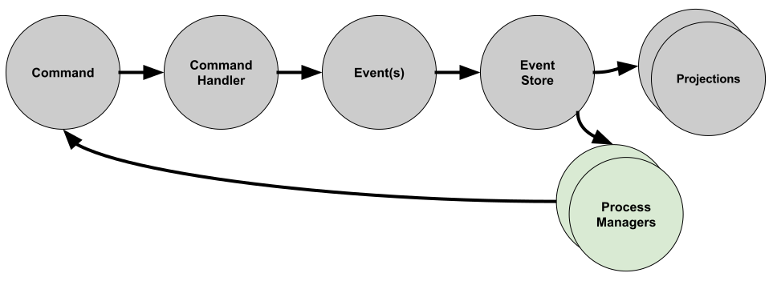

???

The Process Manager is our missing piece. They live downstream of the persisted events, but can feed new commands back into the system.

---

# Process Manager

* Listens for events
* Can issue new commands
* Can aggregate state
* Is a GenServer spawned dynamically on an initial event
* *Must* be keyed on a common key (every event must contain that id)
* Has a lifecycle based on events

???

---
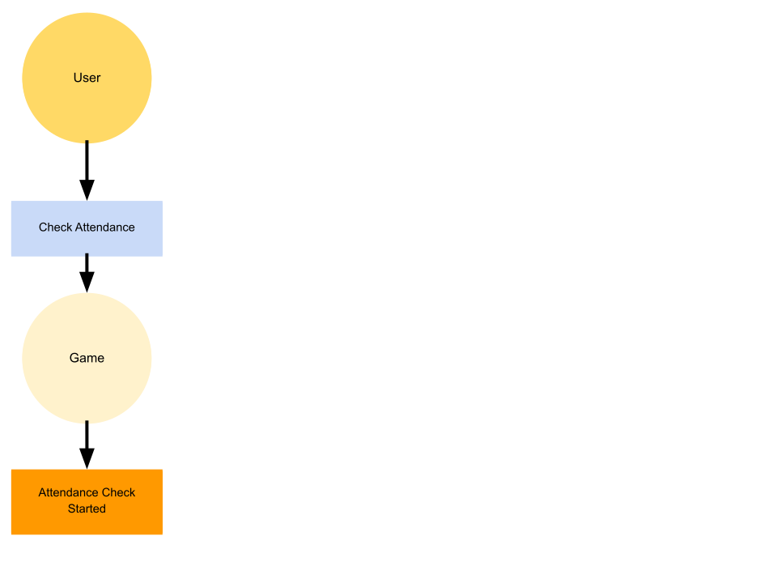

???

---
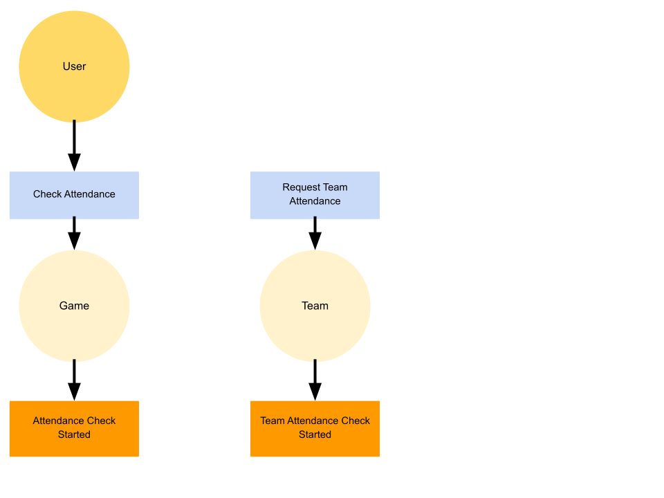

???

---
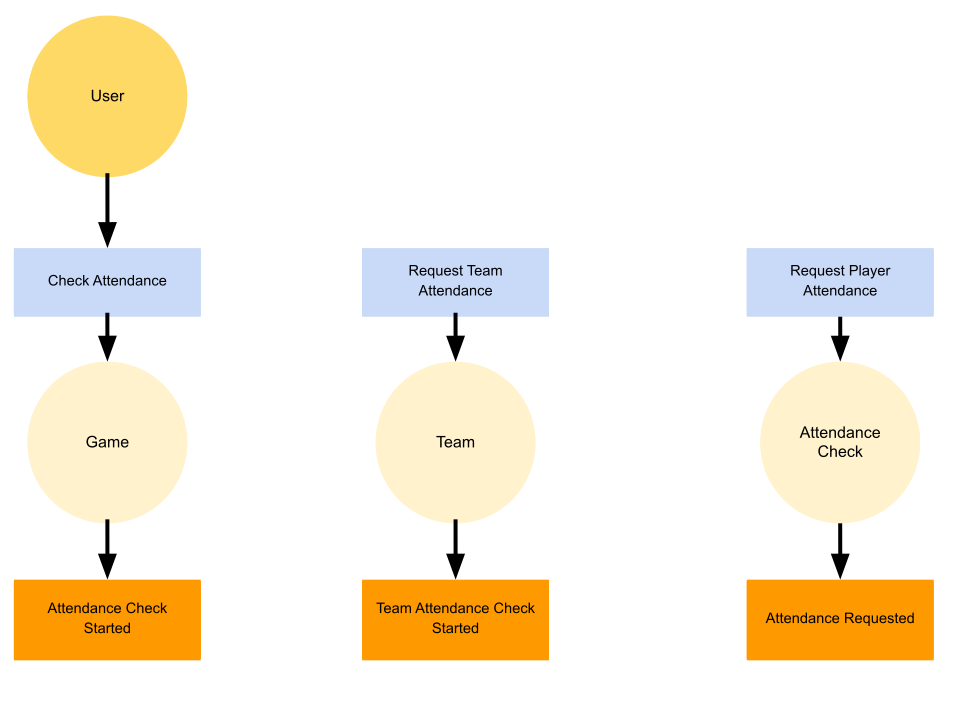

???

---
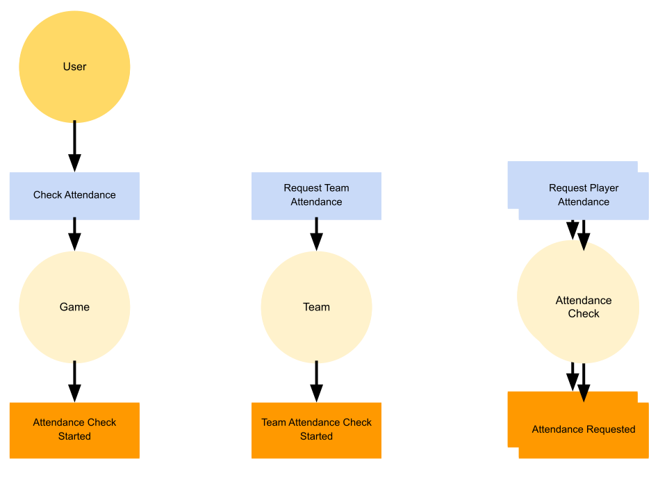

???

---
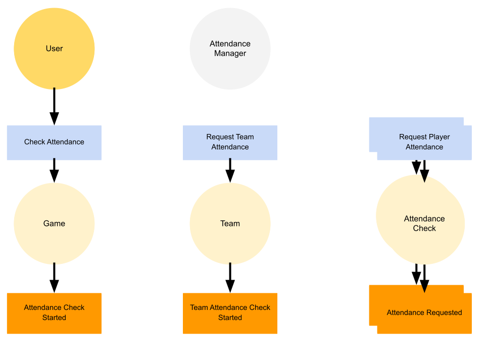

???

---
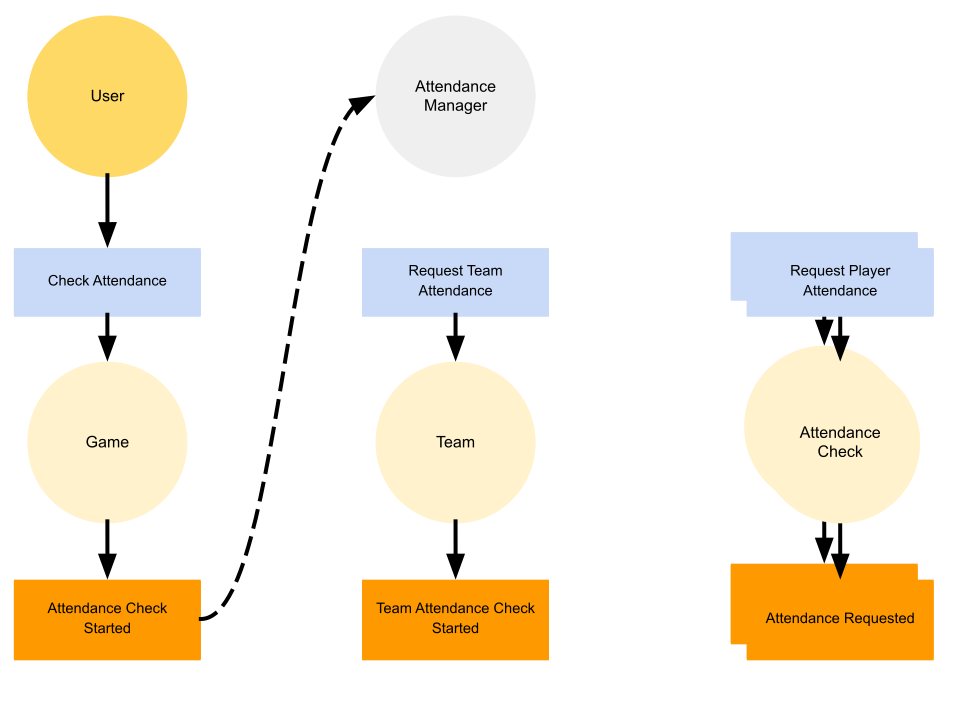

???

---


???

---
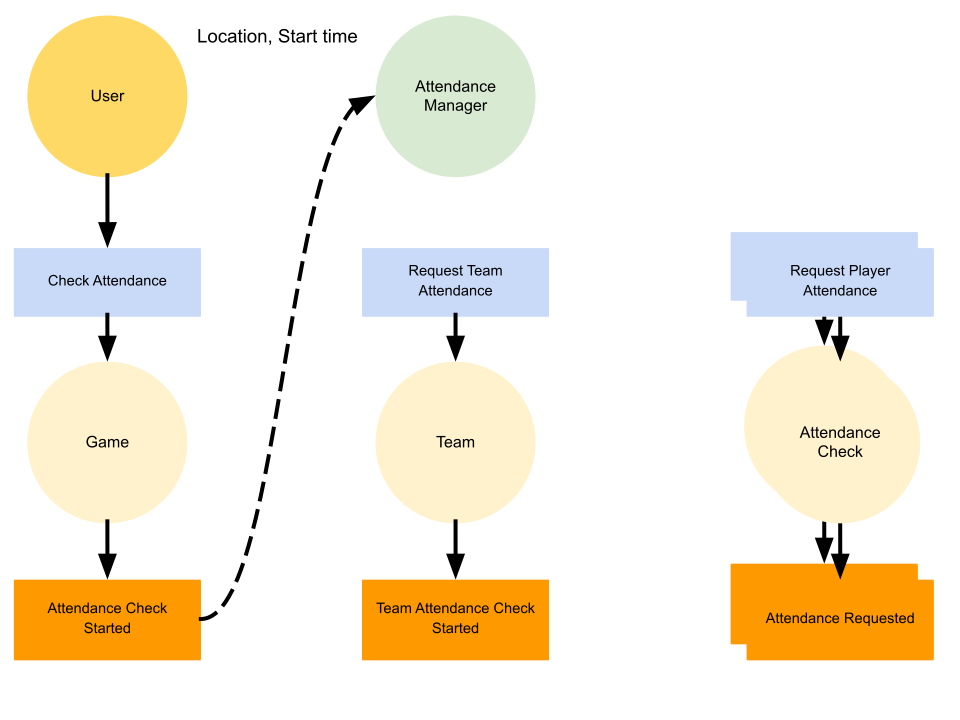

???

---


???

---


???

---


???

---


???

---

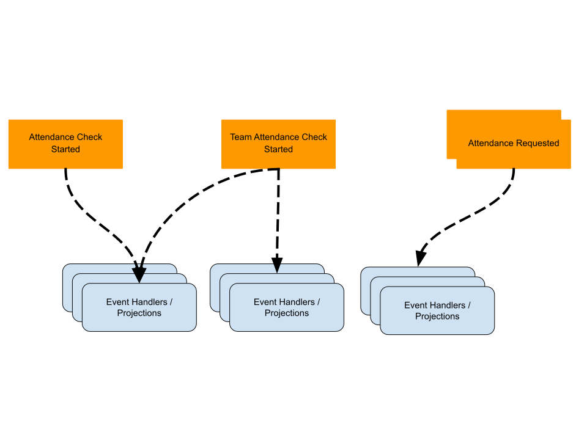

???

---


https://github.com/commanded/commanded
https://github.com/slashdotdash
