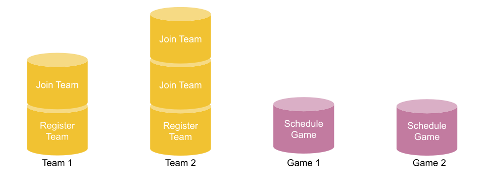

class: center, middle

# Event sourcing/CQRS in Elixir with Commanded:
## Where the rubber hits the road.

???

This is my 2nd talk on ES/CQRS, the last one was theoretical and this will be about how to apply the patterns in Elixir.

---
class: center, middle, inverse

# Ben Moss
### Bitfield Consulting

[ben@bitfield.co](mailto:ben@bitfield.co)

[github.com/drteeth](https://github.com/drteeth)

[@benjamintmoss](https://twitter.com/benjamintmoss)

???

Hi I’m Ben Moss,
* I consultant doing Ruby, Elixir and Android work through my shop Bitfield

---
class: center, middle, inverse

# Motivating example project

Ask players if they are coming to a Soccer game

Provide them with a way of answering yes/no/maybe

???

I'm going to go over an attendance tracker that I wrote for a soccer league I play in.
The idea is that before a game, the app will send out an email to each player asking if they will attend, and they can respond yes/no/maybe with a click.

---

# The Problem

* Ask 40 people if they are coming to tomorrow's game
* Currently a mass-email thread
* Some people reply more than once
* Some people can't be bothered to reply
* Some people talk about what they had for breakfast
* Bounce and Out-of-office notifications
* Getting an idea of who is coming is tricky

---
class: middle, center

# Inevitably... "I know, I'll make an app!"

???

inevitably...

---
class: middle

# "Attend"

* Attendance tracker
* Register teams
* Add players to a team
* Schedules games for teams
* Teams can ask their members if they are coming to a game
* Members can reply yes/no/maybe by clicking links in an email sent to them

???

It's quite a simple project, but it will take us through some interesting aspects of the patterns.

---
class: middle

# Commanded
https://github.com/commanded/commanded

* CQRS/Event Sourcing framework for Elixir

Ben Smith

---
class: center, middle, inverse

# Recap
Last talk:
https://drteeth.github.io/elixir-es-cqrs

???

* There are a number of talks out there describing both Event Sourcing and CQRS, including one of my own
* I will try to recap the patterns very quick and move on to the implementation details.

---
class: middle

# What is Event Sourcing?

* Keep the complete history of events that lead up to the current moment
* Use that to create a representation of the current state.

---
class: middle

# What is Event Sourcing?

```elixir
# Events
%AccountOpened{id: 1, overdraft: 500}

# Current state
%Account{id: 1, balance: 0, status: :empty}
```

???

Here's a quick example.

Imagine a bank account is opened

And we can imagine the state it could be in

---
class: middle

# What is Event Sourcing?

```elixir
# Events
%AccountOpened{id: 1, overdraft: 500}
%FundsDeposited{id: 1, amount: 100}

# Current state
%Account{id: 1, balance: 100, status: :positive}
```

???

As we Deposit funds, the balance increases

---
class: middle

# What is Event Sourcing?

```elixir
# Events
%AccountOpened{id: 1, overdraft: 500}
%FundsDeposited{id: 1, amount: 100}
%FundsDeposited{id: 1, amount: 100}

# Current state
%Account{id: 1, balance: 200, status: :positive}
```

???

And again

---
class: middle

# What is Event Sourcing?

```elixir
# Events
%AccountOpened{id: 1, overdraft: 500}
%FundsDeposited{id: 1, amount: 100}
%FundsDeposited{id: 1, amount: 100}
%FundsWithdrawn{id: 1, amount: 300}
%AcountOverdrawn{id: 1}

# Current state
%Account{id: 1, balance: -100, status: :overdrawn}
```

???

If we withdraw more than we have, then the balance is adjusted and we're moved into overdraft

---
class: middle

# But how can we query that?

* Report of all withdrawn accounts?
* We need a better way

???

That's great, but it makes it really hard and expensive to query.

---
class: middle

# CQRS
### Command Query Responsibility Segregation


* Commands (Writes) change the state of the system
* Queries (Reads) report the state of the system
* Separate their models and datastores along these lines

???

The main idea here is that there is code that models writing new data and then there is code that handles reads and that they can evolve separately.

We'll see more on that shortly.

---
class: middle, center, inverse

# The Write Side

???

First I'll cover the write side.

---
class: middle

# What we're building

```elixir
# Register a new team
team_id = Attend.register_team("The Alchemists")

# Add a player
Attend.add_player_to_team(team_id, "Ben Moss", "ben@bitfield.co")

# Schedule a game for that team
game_id = Attend.schedule_game(team_id, "Monarch Park", @game_time)

# Check the attendance for the game and that team
Attend.check_attendance(game_id, team_id)

# Simulate clicking "Yes" in the email sent
{player_check_id, yes_token} = parse_yes_token_from_last_test_email()
Attend.confirm_attendance(player_check_id, yes_token)
```

???

You can imagine working from an acceptance test something like this.
* Register a team
* Add a player
* Schedule a game
* Start an Attendance check
* Each player will confirm their attendance

---
class: middle

# Handling our first command: Register a team

```elixir
RegsterTeam{id: 123, name: "The Alchemists"}
```

* Commanded looks for a GenServer in the Registry for Team 123
* Nothing found, spawns a new GenServer for Team 123
* Send it the command as a message
* GenServer will reply with a TeamRegistered event
* It will be stored in the EventStore for us in a stream like "team_123"

???

This is the basic flow for the write side:

* These registry lookups are only true in concept, the actual implementation may differ

---
class: middle

# A 2nd command: Add a player

```elixir
JoinTeam{team_id: 123, player: %{name: "Ben Moss", email: "ben@bitfield.co"}}
```

* Locate GenServer in the Registry
* Found it, send it the command
* Reply with a PlayerJoinedTeam event
* Append it to the EventStore as the 2nd event in the stream "team_123"
* Maintains a list of players as the GenServer's state (in memory)

???

---
class: middle, center

# * Process dies *

???

Before going any further, let's assume that the process is killed somehow and we lose our in-memory state.

---
class: middle

# Adding a 2nd player

```elixir
JoinTeam{team_id: 123, player: %{name: "Alice McGee", email: "alice@example.com"}}
```

* Look for the GenServer for Team 123
* It's not there, spawn a new one
* Load all the events in EventStore for stream "team_123"
* Replay them 1 by 1, changing the GenServer's state
* We can now accept the 2nd player and continue on.

???

---
# Aggregates


```elixir
%RegisterTeam{team_id: 1, name: "A")
```

???

We can get a sense for how aggregates work

As mentioned they are GenServer who serialize access to a single instance.

In essence they provided a transactional boundary around the aggregate. There can be no data races within a single aggregate or it's associated stream of events.

---
# Aggregates


```elixir
%JoinTeam{team_id: 1, player: player1}
```
---
# Aggregates


```elixir
%RegisterTeam{team_id: 2, name: "B")
```
---
# Aggregates


```elixir
%JoinTeam{team_id: 2, player: player2}
```
---
# Aggregates


```elixir
%JoinTeam{team_id: 2, player: player3}
```
---
# Aggregates


```elixir
%ScheduleGame{game_id: 1, team_id: 1}
```
---
# Aggregates



```elixir
%ScheduleGame{game_id: 2, team_id: 2}
```
---
# Aggregates


```elixir
%CancelGame{game_id: 1}
```

---
# Aggregates


```elixir
%StartGame{game_id 1} => :error
```

???

If we try to start Game 2, it's aggregate knows that it has been cancelled and will reject the command.

---
# Aggregates


```elixir
%JoinTeam{team_id: 1, player: player1} => :error
```

???

Likewise, if we try to add player 1 to team 1 again, that aggregate knows enough to reject the command.

* Command only goes to 1 aggregate
* Events order is only guaranteed within a stream (b/c of the aggregate)
* An aggregate can only emit events in it's stream.
* Aggregates are siloed, and do not talk directly to each other.


---
class: inverse, middle, center

# Show me the code

---
class:
# Dispatching a command with the router

* The router dispatches commands for us.
* :ok | {:error, reason}

```elixir
defmodule Attend
  def schedule_game(team_id, location, start_time) do
  game_id = UUID.generate()

  command = %ScheduleGame{
    game_id: game_id,
    team_id: team_id,
    location: location,
    start_time: start_time
  }

  case Router.dispatch(command) do
    :ok ->
      {:ok, game_id}

    error ->
      error
  end
end
```

???

We'll pickup in the middle where we're scheduling a game for a team.
We create a new instance of a command, which are structs, and dispatch it with the Router which we'll see next.

---
class:
# The Router

* Maps commands to "Aggregates"
* Specifies an indentity field
* Lazily spawns GenServers to handle commands

```elixir
defmodule Attend.CommandRouter do
  dispatch(
    [
      ScheduleGame,
      CheckAttendance,
      StartGame,
      CancelGame,
      EndGame
    ],
    to: Game,
    identity: :game_id
  )
end
```

???

* Here we map the ScheduleGame command to the Game.
* Commanded will spawn a GenServer based on the identity and module type given.
* That means we're going to create a new aggregate and spawn a GenServer to listen for commands on, and then we're going to send it the command to handle.

---
class:

# The Aggregate

```elixir
defmodule Attend.Aggregates.Game do
  defstruct [:game_id, :location, :team_id, :start_time,:status]

  def execute(%Game{}, %ScheduleGame{} = command) do
    %GameScheduled{...}
  end

  def execute(%Game{} = game, %CancelGame{} = command) do
    if game.state == :scheduled do
      %GameCanceled{...}
    else
      {:error, "A game must be scheduled to cancel it."}
    end
  end

  def apply(%Game{} = game, %GameScheduled{} = event) do
    # update the local state based on the incoming event
  end

  def apply(%Game{} = game, %GameCanceled{} = event) do
    # update the local state based on the incoming event
  end
end
```

???

The aggregate is a struct representing the current state for the purposes of validating commands against. This is the model of our game on the write side.

* GenServer responsible for the state of a single Game or Team
* Not the entire collection of Games or Teams
* Must accept a Command and return a list of events
* Or return {:error, reason}
* Tracks current state by applying events in sequence

---
class:

# The Aggregate: execute/2

* Acting as a Command Handler
* Returns 0 or more events
* Written to the event store for us by Commanded

```elixir
  def execute(%Game{} = _state, %ScheduleGame{} = command) do
    %GameScheduled{
      game_id: command.game_id,
      team_id: command.team_id,
      location: command.location,
      start_time: command.start_time
    }
  end
```

???

This is the spot where we decide if we're going to accept or reject a command. If we accept it, we'll emit 1 or more events which describe the change in the system.

If we reject it, we'll return an error we can show to the user.

This is the first Command in the Game's lifecycle and we're returning a GameScheduled event.

---
# The Aggregate: execute/2 with validation

* Validate input based on state
* Protect invariants
* Our oportunity to give feedback to the user

```elixir
  def execute(%Game{} = game, %CheckAttendance{} = command) do
    cond do
      game.status == :cancelled ->
        {:error, :game_cancelled}

      game.status == :ended ->
        {:error, :game_already_ended}

      game.team_id != command.team_id ->
        {:error, :team_not_scheduled_for_game}

      true ->
        %AttendanceCheckStarted{
          check_id: command.check_id,
          game_id: command.game_id,
          team_id: command.team_id

  end
```

???

Here we're handling another command against our aggregate. We only want to allow an attendance check if the game scheduled. We also want to provide meaningful feedback to the user if we reject the command.

---
class:

# The Aggregate: apply/2

* Apply clause for each event on an aggregate
* Takes the previous state and an event as input
* Returns the new state
* Called after the events have been persisted
* Also called when re-hydrating the aggregate


```elixir
  def apply(%Game{} = game, %GameScheduled{} = event) do
    %{ game |
        game_id: event.game_id,
        team_id: event.team_id,
        location: event.location,
        start_time: event.start_time,
        status: :scheduled
    }
  end
```

???

Here we're setting up the initial state of our Game so we can validate further commands against it later.

---
class:

# The story so far:

* Each Aggregate will handle Commands sent to it by the Router
* Any Events returned will be persisted to disk
* Events in an Aggregate's stream will be applied to it
* Each Aggregate will maintain enough internal state to validate Commands

* Aggregates are running concurently with each other
* Aggregates run serially internally
* Express and capture a series of intents
* Transform those into immutable facts

???

---
class: middle, center, inverse

# The Read Side

???

We can leave the write side for now and see how we get data out of the system. Queries are handled by the read side.
The read side is a series of what is called projections of the events into an cohesive whole that we can query on.

---

# Show me the roster for a Team

* For every read, we'd have to replay all of the events
* Instead, maintain a view of the roster based on the events as they come through
* Much like a materialized view
* Called Projections but are a specialization of an Event Handler

---
class:

# Projections / Event Handlers

* Populate caches/tables to handle queries from the UI
* Built on the events from the Write side
* Listens for Events and performs effects:
* Writing to a cache, sending an email, etc
* 1 elixir process per Projection

???

---

# TeamDetail projection

```elixir
defmodule Attend.EventHandlers.TeamProjector do
  use Commanded.Event.Handler, name: __MODULE__

  def handle(%Events.TeamRegistered{} = event, _metadata) do
    TeamDetail.insert(%Team{
      id: event.team_id,
      name: event.name,
      players: []
    })
    :ok
  end
```

???

Here we have the Team detail projection. It's job is to listen for all of the events that it need to produce a blob of detail that the UI can use to fill out the detail view of the team. That means: Upcoming games, team members, name etc.

We start off by listening for the Team Register even and persist that to disk. Storage is not prescribed, I'm using redis here but I've hidden the details away behind a module.

---


# TeamDetail projection

```elixir
defmodule Attend.EventHandlers.TeamProjector do
  use Commanded.Event.Handler, name: __MODULE__

  def handle(%Events.TeamRegistered{} = event, _metadata) do
    TeamDetail.insert(%Team{
      id: event.team_id,
      name: event.name,
      players: []
    })
    :ok
  end

  def handle(%Events.JoinedTeam{} = event, _metadata) do
    TeamDetail.get(event.team_id)
    |> TeamDetail.add_player(event.player)
    :ok
  end

  def handle(%Events.LeftTeam{} = event, _metadata) do
    TeamDetail.get(event.team_id)
    |> TeamDetail.remove_player(event.player)
    :ok
  end
```

???

For subsequent team events, we can update the state

---

# TeamDetail projection

```elixir
  def handle(%Events.GameScheduled{} = event, _metadata) do
    Team.add_game(%Game{
      game_id: event.game_id,
      location: event.location,
      start_time: event.start_time,
      team_id: event.team_id
    })
    :ok
  end

  def handle(%Events.GameCancelled{} = _event, _metadata) do
     # Mark the game cancelled
    :ok
  end

  def handle(%Events.GameEnded{} = _event, _metadata) do
     # Mark the game ended
    :ok
  end
```

???

Event handlers can use events from across aggregates to build up their state


---
class: inverse, center, middle

# A 2nd Event Handler

???

* Event handlers may also be used to perform side effects like sending email or contacting another service

---

# Sending the attendance email

* For each player on a Team, send them an email asking for their attendance
* In medias res
* Required: Game ID, location, time, player name, email address
* Use an Event handler to listen for GameScheduled and AttedanceRequested events

---

# Sending the attendance email


???

* Event Handler to orchestrate
* Local cache to keep state
* Mailer to send the mail

---
# Sending the attendance email


???

* When a GameScheduled event comes through

---
# Sending the attendance email


???

* And write it to the cache

---
# Sending the attendance email


???

* When an AttendanceRequested event comes in

---
# Sending the attendance email


???

* Retrieve the data about the game

---
# Sending the attendance email


???

* Combine that incoming data from the event
* Send the email

---
# Sending the attendance email


???

* Here's all the arrows at once so you can see

---
class: inverse, middle

# We can go on like this for some time
* Register team
* Add player
* Remove player
* Cancel game
* Start game
* End game

???

We've seen enough of the basic now that we can continue this way for a long while.

We can continue to add Commands, Aggregates, projections and handlers as we've seen.
This works because up until now each aggregate has had enough state on it's own to handle the incoming commands.

Each Aggregate is it's own happy litle island.

What happens when we need to get a message between them?

We can see it when we go to request attendance for a team's players to a game.

---

# Attendance Check

### Requirements
* Don't allow a *Check* to be requested for a *Game* that has ended or been cancelled.
* Ask each player from a given *Team* if they will be attending a given *Game*.

???

---
# Attendance Check


???

Can't cross aggregate boundaries

We've got all the data we need, but we can't cross aggregate boundaries to get at it.


---

# Attendance Check

### Requirements
* Don't allow a *Check* to be requested for a *Game* that has ended or been cancelled.
* Ask each player from a given *Team* if they will be attending a given *Game*.

### Which aggregate will handle the command?

???

---

# Attendance Check

### Requirements
* Don't allow a *Check* to be requested for a *Game* that has ended or been cancelled.
* Ask each player from a given *Team* if they will be attending a given *Game*.

### Which aggregate will handle the command?
1. We need to validate against the status of Game, so Game?

???

---

# Attendance Check

### Requirements
* Don't allow a *Check* to be requested for a *Game* that has ended or been cancelled.
* Ask each player from a given *Team* if they will be attending a given *Game*.

### Which aggregate will handle the command?
1. We need to validate against the status of Game, so Game?
2. We need the list of players that Team has, so Team?

???

---

# Attendance Check

### Requirements
* Don't allow a *Check* to be requested for a *Game* that has ended or been cancelled.
* Ask each player from a given *Team* if they will be attending a given *Game*.

### Which aggregate will handle the command?
1. We need to validate against the status of Game, so Game?
2. We need the list of players that Team has, so Team?
3. It feels like we'd like to model the Check as it's own aggregate, so Check?

???

---

# Process Manager

* Listens for events
* Can issue new commands
* Can aggregate state
* Is a GenServer spawned dynamically on an initial event
* *Must* be keyed on a common key (every event must contain that id)
* Has a lifecycle based on events

???

The Process Manager is our missing piece. They live downstream of the persisted events, but can feed new commands back into the system.

---
### Request attendendance with a Process Manager


???

* The User asks for an Attendance Check (Game, Team)
* If the game is in a valid state, an Attendance Check Started event is produced.

---
### Request attendendance with a Process Manager


???

* On the team side, if we asked to start a team check, then it could produce a Team Attendance Check Started event with the team and player details

---
### Request attendendance with a Process Manager


???

* For the check, if we Request an individual player's attendance, then it could produce the Attendance Requested event required to send the email we saw earlier.

---
### Request attendendance with a Process Manager


???

Really for a given Check we want that to happen for each player on the team

---
### Request attendendance with a Process Manager


???

This is where the Process manager comes in

* Process managers are not started until they are needed
* So no process exists yet.

---
### Request attendendance with a Process Manager


???

When the Attendance Check Started event happens

---
### Request attendendance with a Process Manager


???

Commanded will start up a GenServer for *This* attendance check. It will be keyed on team_id

---
### Request attendendance with a Process Manager


???

It will foward the details of the game and the team id to the next command

---
### Request attendendance with a Process Manager


???

And then send a Request Team Attendance Command to the Router

---
### Request attendendance with a Process Manager


???

Which will end up in a Team Attedance Request Started event, which the Attendance manager will also be listening for

---
### Request attendendance with a Process Manager


???

And finally, it will fire a command for each team member, requesting their attendance

It includes name, team, game, location and everything need to send the email as we saw earlier.

From here, it could also listen for game started or game cancelled events and act accordingly

---
class:

# Process Manager

```elixir
defmodule Attend.ProcessManagers.AttendanceCheckManager do
  use Commanded.ProcessManagers.ProcessManager,
    name: __MODULE__,
    router: Attend.CommandRouter

  defstruct [...]

  def interested?(%AttendanceCheckStarted{} = event), do:
    {:start, event.game_id}

  def interested?(%TeamAttendanceCheckStarted{} = event), do:
    {:continue, event.game_id}

  def interested?, do: false

  def handle(state, event) do
    # Return 0 or more commands
  end

  def apply(state, event) do
    # Track whatever state is required
  end
```

???

This is our Proces Manager

* It has a reference to the router so it can send commands
* It defines a struct for maintaining state
* It must let the library know if it is interested in a particular event
* If it is interested, it must say that it wants to start, continue or stop the GenServer for this manager.

---
class:

# Process Manager

```elixir
defmodule Attend.ProcessManagers.AttendanceCheckManager do
  ...
  def handle(%State{} = _state, %AttendanceCheckStarted{} = event) do
    # When Game starts a check, send a Command to Team to start it's own
    %RequestTeamAttendance{
      check_id: event.check_id,
      game_id: event.game_id,
      team_id: event.team_id
    }
  end

  def handle(%State{} = _state, %TeamAttendanceCheckStarted{} = event) do
    # When Team starts it's check, send a new Check Command for each team member
    event.players
    |> Enum.map(fn player ->
      %RequestAttendance{
        player_check_id: player.player_check_id,
        check_id: event.check_id,
        game_id: event.game_id,
        team: event.team,
        player: player
      }
    end)
  end
  ...
end
```

???

Here we can see the handler functions


---
class:

# Process Manager

```elixir
defmodule Attend.ProcessManagers.AttendanceCheckManager do
  ...
  defstruct [:check_id, player_checks: []]

  def apply(%State{} = state, %TeamAttendanceCheckStarted{} = event) do
    # Keep track of the checks we start to handle cancellation etc
    player_checks =
      event.players
      |> Enum.map(fn player ->
        player.player_check_id
      end)

    %{state | check_id: event.check_id, player_checks: player_checks}
  end
end
```

???

A process manager may also build up state by providing an apply function

Much like an Aggregate does

---
class: inverse, middle, center
# Conclusion

---

## Pros:
* Elixir and Commanded fit very well with ES/CQRS
* Write side transactional boundaries are clearly drawn
* Tailor and optimize read side as requirements change
* Excellent for inter-service communication
* Fun, everything is new

## Cons:
* Unfamiliar to most devs
* Finding aggregate boundaries is dificult
* Hard, everything is new

---
class: center, middle, inverse

# Ben Moss
### Bitfield Consulting

[ben@bitfield.co](mailto:ben@bitfield.co)

[github.com/drteeth](https://github.com/drteeth)

[@benjamintmoss](https://twitter.com/benjamintmoss)
